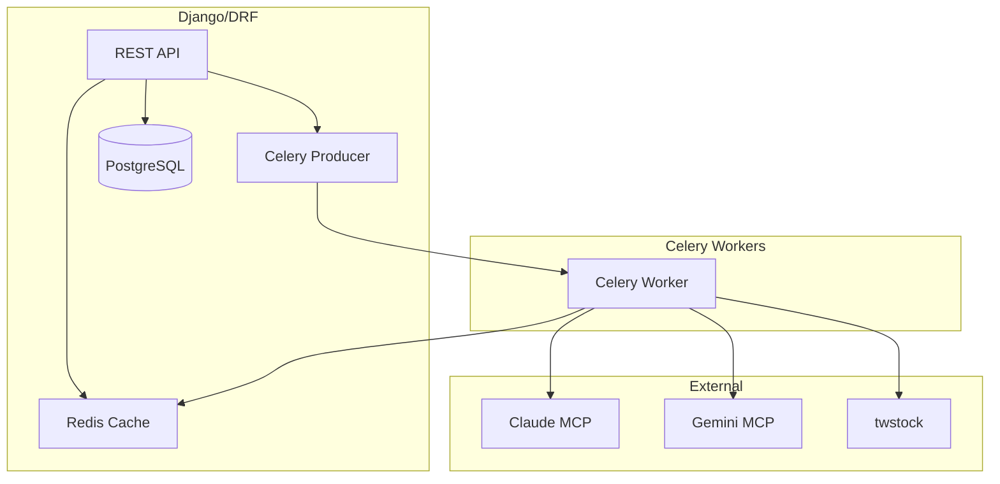

# Omni Pretest
## Setup Environment
* Download [docker](https://www.docker.com/get-started) and Install

* [Fork](https://docs.github.com/en/get-started/quickstart/fork-a-repo) this **pretest** project to your own repository

* Clone **pretest** project from your own repository
    ```
    git clone https://github.com/[your own account]/pretest.git
    ```

* Checkout **pretest** directory
    ```
    cd pretest
    ```

* Start docker container
    ```
    docker-compose up
    ```

* Enter activated **pretest-web-1** container
    ```
    docker exec -it pretest-web-1 bash
    ```
    Note:

    * This container codebase is connected to **pretest** project local codebase
    * If you need to migrate migration files or test testcases, make sure do it in **pretest-web-1** container
---
## Requirements
* Construct **Order** Model in **api** app

    The below information is necessary in **Order** model:
    * Order-number
    * Total-price
    * Created-time

* Construct **import_order** api ( POST method )
    * Validate access token from request data
    
        ( accepted token is defined in **api/views.py** )
    * Parse data and Save to corresponding fields
* Construct api unittest

---
## Advanced Requirements ( optional )
* Replace the statement of checking api access token with a decorator

* Extend Order model
    * Construct **Product** model
    * Build relationships between **Order** and **Product** model

* Get creative and Extend anything you want  
---
## Melo's(吳邁龍) project about Stock investment application
# Investment Chatbot **Backend API** Service

Backend-only README for your Django + DRF + Celery + Redis + twstock service. No frontend/UI content.

---

## 0. First Step – Create your `.env`

Create a file named `.env` in the project root (same level as `docker-compose.yml`). Example:

```dotenv
# ---- Django ----
DJANGO_SETTINGS_MODULE=pretest.settings
SECRET_KEY=change_me
DEBUG=1
ALLOWED_HOSTS=*

# ---- Database ----
POSTGRES_NAME=pretest
POSTGRES_USER=postgres
POSTGRES_PASSWORD=postgres
POSTGRES_HOST=db
POSTGRES_PORT=5432
DATABASE_URL=postgres://postgres:postgres@db:5432/pretest

# ---- Redis / Celery ----
CELERY_BROKER_URL=redis://redis:6379/0
CELERY_RESULT_BACKEND=redis://redis:6379/1
REDIS_URL=redis://redis:6379/0

# ---- MCP / LLM keys ----
CLAUDE_API_KEY=sk-xxxxxxxxxxxxxxxxxxxxxxxxxxxxxxxx
GOOGLE_API_KEY=AIzaSyxxxxxxxxxxxxxxxxxxxxxxxxxxxxx   # Gemini key
MCP_CLAUDE_URL=http://mcp:8001/claude
MCP_GEMINI_URL=http://mcp:8001/gemini
```

> Adjust keys/hosts/ports as needed. Inside Docker, service names (`db`, `redis`, `mcp`) are resolvable.

---

## 1. Backend Architecture



### Flow Example – Analyze Stock

1. `POST /api/analyze/` enqueues Celery task.
2. Worker calls twstock & both MCP endpoints.
3. Result cached in Redis (`analyze:{stock_id}`) and returned.
4. `GET /api/analyze/<task_id>/` polls state/result.

---

## 2. Tech Stack

* Django 4.2 + DRF (API)
* SimpleJWT (auth)
* Celery + Redis (async tasks, cache)
* PostgreSQL (persistence)
* twstock (Taiwan stock data & BestFourPoint)
* httpx/requests (LLM HTTP calls)
* Docker / Docker Compose

---

## 3. Project Structure (example)

```
pretest/
├─ manage.py
├─ pretest/
│  ├─ settings.py
│  ├─ celery.py
│  ├─ urls.py
│  └─ ...
└─ api/
   ├─ models.py
   ├─ serializers.py
   ├─ views.py
   ├─ tasks.py
   ├─ urls.py
   └─ utils/
```

---

## 4. Local Development (without Docker)

1. **Install deps**
   `pip install -r requirements.txt`
2. **Create `.env`** (see section 0)
3. **Migrate DB**

   ```bash
   python manage.py makemigrations
   python manage.py migrate
   ```
4. **Run services**

   ```bash
   # Django API
   python manage.py runserver 0.0.0.0:8000

   # Celery worker
   celery -A pretest worker -l info
   ```

   (Run beat only if needed: `celery -A pretest beat -l info`)

---

## 5. Docker Compose

Your provided `docker-compose.yml` already wires db/redis/mcp/backend/celery.

Run:

```bash
docker compose up --build
```

Ensure your backend image runs migrations automatically (via entrypoint script) or run:

```bash
docker compose exec backend python manage.py migrate
```

---

## 6. Environment Variables (Quick Table)

| Name                     | Purpose                | Example                                          |
| ------------------------ | ---------------------- | ------------------------------------------------ |
| DJANGO\_SETTINGS\_MODULE | Django settings module | pretest.settings                                 |
| SECRET\_KEY              | Django secret          | change\_me                                       |
| DEBUG                    | Debug mode (0/1)       | 1                                                |
| ALLOWED\_HOSTS           | Django hosts           | \*                                               |
| POSTGRES\_\*             | DB creds (compose)     | postgres/postgres/...                            |
| DATABASE\_URL            | DSN (optional helper)  | postgres\://...                                  |
| CELERY\_BROKER\_URL      | Celery broker          | redis\://redis:6379/0                            |
| CELERY\_RESULT\_BACKEND  | Celery result backend  | redis\://redis:6379/1                            |
| REDIS\_URL               | General cache URL      | redis\://redis:6379/0                            |
| CLAUDE\_API\_KEY         | Claude API key         | sk-xxx                                           |
| GOOGLE\_API\_KEY         | Gemini API key         | AIzaSyxxx                                        |
| MCP\_CLAUDE\_URL         | MCP Claude endpoint    | [http://mcp:8001/claude](http://mcp:8001/claude) |
| MCP\_GEMINI\_URL         | MCP Gemini endpoint    | [http://mcp:8001/gemini](http://mcp:8001/gemini) |

---

## 7. API Endpoints

**Auth**

* `POST /api/auth/register/`  → `{username, password}`
* `POST /api/auth/login/`     → returns `{refresh, access}`
* `POST /api/auth/logout/`    → optional, blacklist refresh

**Trading**

* `POST /api/trade/buy/`      → `{stock_id, buy_price, quantity}`
* `POST /api/trade/sell/`     → `{stock_id, sell_price, quantity}`

**Holdings & History**

* `GET  /api/holdings/`       → current holdings (Redis)
* `POST /api/holdings/`       → sync Redis → Postgres
* `GET  /api/history/`        → trade history (Postgres)

**Stock & Analysis**

* `GET  /api/price/?stock_id=2330`
* `POST /api/analyze/`        → `{stock_id}` → returns `task_id`
* `GET  /api/analyze/<task_id>/`

---

## 8. Testing

### 8.1 Manual (curl)

```bash
# Register
curl -X POST :8000/api/auth/register/ -H 'Content-Type: application/json' \
  -d '{"username":"tester","password":"secret123"}'

# Login
curl -X POST :8000/api/auth/login/ -H 'Content-Type: application/json' \
  -d '{"username":"tester","password":"secret123"}'
ACCESS_TOKEN="<paste access>"

# Buy
curl -X POST :8000/api/trade/buy/ \
  -H "Authorization: Bearer $ACCESS_TOKEN" -H 'Content-Type: application/json' \
  -d '{"stock_id":"2330","buy_price":860,"quantity":5}'

# Holdings
curl -H "Authorization: Bearer $ACCESS_TOKEN" :8000/api/holdings/

# Sell
curl -X POST :8000/api/trade/sell/ \
  -H "Authorization: Bearer $ACCESS_TOKEN" -H 'Content-Type: application/json' \
  -d '{"stock_id":"2330","sell_price":880,"quantity":2}'

# History
curl -H "Authorization: Bearer $ACCESS_TOKEN" :8000/api/history/

# Analyze
curl -X POST :8000/api/analyze/ \
  -H "Authorization: Bearer $ACCESS_TOKEN" -H 'Content-Type: application/json' \
  -d '{"stock_id":"2330"}'
TASK_ID="<task id>"

curl -H "Authorization: Bearer $ACCESS_TOKEN" :8000/api/analyze/$TASK_ID/
```

### 8.2 Pytest (unit/integration)

Install:

```bash
pip install pytest pytest-django
```

Sample test (`tests/test_trade_flow.py`):

```python
import pytest
from rest_framework.test import APIClient

@pytest.mark.django_db
def test_buy_sell_flow():
    c = APIClient()
    # register
    r = c.post('/api/auth/register/', {"username":"t","password":"p123456"}, format='json')
    assert r.status_code == 201
    # login
    r = c.post('/api/auth/login/', {"username":"t","password":"p123456"}, format='json')
    access = r.data['access']
    c.credentials(HTTP_AUTHORIZATION=f'Bearer {access}')
    # buy
    r = c.post('/api/trade/buy/', {"stock_id":"2330","buy_price":100,"quantity":1}, format='json')
    assert r.status_code == 200
    # sell
    r = c.post('/api/trade/sell/', {"stock_id":"2330","sell_price":110,"quantity":1}, format='json')
    assert r.status_code == 200
```

Run:

```bash
pytest -q
```

---

## 9. Troubleshooting Cheatsheet

* **`relation "api_tradehistory" does not exist`** → run migrations.
* **`float() argument must be ... NoneType`** → missing fields; check serializer payload.
* **`ImportError: cannot import name 'XSerializer'`** → forgot to define or adjust import.
* **Celery `ValueError('a coroutine was expected, got <_GatheringFuture pending>')`** → wrap `asyncio.gather` in a coroutine.
* **`TypeError: expected a bytes-like object, UUID found` (task result)** → use `<str:task_id>` or cast `task_id = str(task_id)`.

## Submit
* After receiving this pretest, you have to finish it in 7 days
* Create a [pull request](https://docs.github.com/en/pull-requests/collaborating-with-pull-requests/proposing-changes-to-your-work-with-pull-requests/creating-a-pull-request-from-a-fork) and name it with your name (using your Chinese and English name as provided on your resume) ( 王小明(Apple) - 面試 )

* Feel free to let us know if there is any question: sophie.lee@bebit-tech.com
